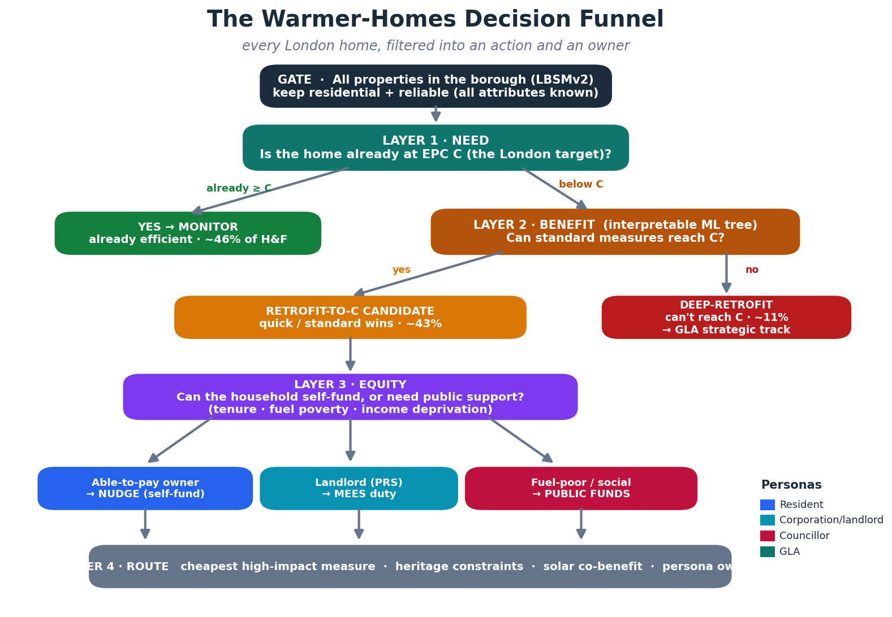

# Warmer Homes for London
### A layered decision funnel that turns building-stock data into *action* and an *owner*

---

## 1. The problem

London wants **warmer homes for all** — homes that hit the **EPC C** standard, that
lift households out of **fuel poverty**, and that move the city towards **net zero**.
The hard part isn't the ambition, it's the triage: there are millions of homes, finite
budgets, and the households who need help most are often the ones *least* able to pay
for it. The challenge brief puts it plainly — *"how data can help deliver retrofit for
low-income Londoners."*

So the real question is not "which homes are inefficient?" It's four questions at once:

> **Which homes need work · which would benefit most · who should pay · and what exactly should be done first?**

Our answer is a single, explainable **decision funnel** built on the London Building
Stock Model v2 (LBSMv2). Every property in a borough falls through the funnel and comes
out the bottom with a **priority tier**, a **funding route**, a **recommended first
measure**, and a **named owner** among the four personas.

---

## 2. The core idea — a layered decision funnel

Rather than one opaque score, we think in **layers**, each answering one question and
each auditable on its own. This is the "decision tree as a way of thinking": a resident,
a councillor, a GLA analyst and a landlord can all read the same logic and see exactly
where their home or their portfolio lands.

| Layer | Question | Data points used | Output |
|---|---|---|---|
| **Gate** | Is this a home we can stand behind? | `building_use`, all `*_known` flags | residential + reliable rows only |
| **1 · NEED** | Is it already at EPC C? | `epc_rating` vs target **C** | `already_efficient` → **monitor** |
| **2 · BENEFIT** | Can standard measures reach C? *(ML tree)* | fabric: walls, roof, glazing, heating, age, form | `retrofit_to_C` vs `deep_retrofit` |
| **3 · EQUITY** | Can they self-fund, or need support? | `tenure`, `fuel_poverty`, `imd19_income_decile` | funding route |
| **4 · ROUTE** | What's the cheapest high-impact first move? | wall/roof/glazing/heat flags, `listed`, conservation, solar | measure + constraints + owner |

The clever move is in **Layer 2**. The LBSMv2 gives us both the *current* EPC and the
*potential* EPC after modelled measures — and potential is **always ≥ current**. So we
can define a genuinely useful, non-trivial target:

- **Retrofit-to-C candidate** = *currently below C* **and** *standard measures can lift it to C*. These are the **wins** — the homes where a normal retrofit gets them over the line.
- **Deep-retrofit** = below C but **can't** reach C even with standard measures. These need a different, strategic programme — and mixing them into the mainstream target would quietly sabotage it.

---

## 3. The model — interpretable by design

Layer 2 is a **shallow decision tree** (`scikit-learn`, depth 6) that predicts whether a
home is a *retrofit-to-C candidate* **from its physical fabric alone**. We deliberately
keep the current/potential EPC scores *and* raw energy consumption **out** of the model:
those are near-synonyms for the answer and would let the tree cheat. Forcing it to reason
from **walls, roof, glazing, heating, age and form** is what makes the output a *retrofit
story a person can act on*, not a black box.

**Performance on Hammersmith & Fulham** (25% hold-out test set):

| Metric | Value |
|---|---|
| ROC-AUC | **0.75** |
| Accuracy | 0.68 |
| Precision | 0.62 |
| Recall | 0.64 |
| F1 | 0.63 |

That is a strong, honest result for a *single tree you can print on one page* — we trade a
few points of accuracy for full transparency, which is the right call for public money.
(A `skore` evaluation report and the full IF/THEN rules are exported alongside.)

**What physically drives priority** (feature importance):

1. **Walls not insulated** — the single strongest signal (0.32)
2. **Flat vs. house** (0.23) — flats behave very differently
3. Number of storeys · roof type · heating type · glazing · construction age

The tree's very first question is the most intuitive one imaginable: *"are the walls
already insulated?"* — which is exactly how a retrofit surveyor would start.

---

## 4. Four personas, one dataset

The same scored output serves all four audiences, each with a different call to action:

- **Residents (able-to-pay owners).** For owner-occupiers in non-deprived, low-fuel-poverty
  contexts, the message is *"here's why and how a retrofit pays off for you"* — comfort,
  bills, property value, plus the solar co-benefit where the roof supports it. They
  self-fund; the council just **nudges**. *(≈3,800 homes in H&F.)*
- **Councillors (per borough).** The council gets a **ranked target list** — Tier-0 urgent
  homes, an LSOA roll-up (`lsoa_summary.csv`) to target *streets not just homes*, and a
  clear split of who needs public money. This is where scarce ECO/local grant funding
  goes: fuel-poor and income-deprived households who *can't* do it themselves. *(≈13,300
  homes routed to public support.)*
- **Corporations / landlords (per borough).** Private-rented homes below C are flagged as a
  **MEES compliance** population — a defined obligation, and a defined market for
  retrofit-as-a-service providers. *(≈7,800 homes.)*
- **GLA (London-wide).** The **deep-retrofit** segment — homes that *can't* reach C with
  standard measures — is a strategic, cross-borough programme the GLA can size and fund
  distinctly, rather than letting it distort borough-level C targets. *(≈5,000 homes in
  one borough alone.)*

The twofold strategy the challenge asks for falls straight out of Layer 3: **people who
can afford it are shown why to act themselves** (and everyone benefits as the stock
improves), while **local authorities are handed a precise map of who can't — so resources
land where they matter.**

---

## 5. Results — Hammersmith & Fulham

From **100,320** LBSMv2 records, **46,004** pass the gate (residential + fully-known
attributes). Of those:

| Segment | Homes | Share |
|---|---:|---:|
| Already meet EPC C → monitor | 21,162 | 46.0% |
| **Retrofit-to-C candidates** (the wins) | **19,844** | **43.1%** |
| Deep-retrofit (can't reach C) → GLA | 4,998 | 10.9% |
| — of which **Tier-0 URGENT** | 2,486 | — |

**Where the public money should go** (funding route):

| Route | Homes |
|---|---:|
| Landlord obligation (MEES) + support | 7,826 |
| Grant-supported owner (ECO / local) | 7,185 |
| Public / social-landlord programme | 6,070 |
| Able-to-pay owner (self-fund + nudge) | 3,761 |

**What to actually do first** (cheapest high-impact measure):

| First measure | Homes |
|---|---:|
| Solid wall insulation (high-cost, high-impact) | 24,182 |
| Loft / roof insulation (quick, low-cost win) | 9,832 |
| Low-carbon heating (heat pump) switch | 6,607 |
| Cavity wall insulation (quick win) | 3,063 |

The dominance of **solid-wall** homes (H&F's stock is ~70% solid-wall, much of it
pre-1929) is the borough's defining retrofit challenge — and a signal that heritage
constraints (conservation areas cover ~half of H&F) must be handled as a first-class
workflow, which Layer 4 flags per property.

The **top-priority neighbourhoods** combine high candidate density with high fuel poverty
— e.g. LSOAs *H&F 001B / 001E* (~18% fuel poverty), giving councillors an immediate,
defensible place to start.

---

## 6. Scaling to London

The pipeline is **borough-agnostic**: point it at any borough's LBSMv2 CSV and it
re-runs the full funnel, retrains its own explainable tree, and exports the same bundle.
Because each borough gets its *own* model, the logic stays honest to local stock (a
solid-wall inner-London borough and a cavity-wall outer one get different trees — as they
should).

**Next steps we'd prioritise:**

1. **Cost & carbon layer** — attach £/measure and tCO₂e/measure to turn the priority list
   into a value-for-money ranking and a carbon-abatement curve.
2. **Bring back the "unknown" homes** — the MVP uses only fully-known rows; the next
   version keeps modelled rows with a *confidence flag* so no home is invisible.
3. **Resident-facing front end** — a postcode lookup that shows a household its tier,
   its recommended measure, and the grants it qualifies for.
4. **Validate against delivered retrofits** — close the loop by checking predicted
   candidates against homes that actually reached C.

> *Note on targets:* specific policy dates (EPC-C deadlines, net-zero year, MEES minima)
> should be confirmed against the current challenge brief and DESNZ/GLA guidance before
> publication — the model's thresholds are set in one clearly-labelled CONFIG block and
> take seconds to adjust.
